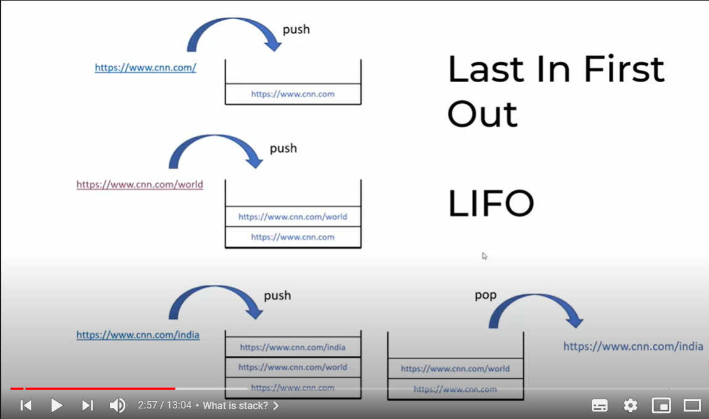
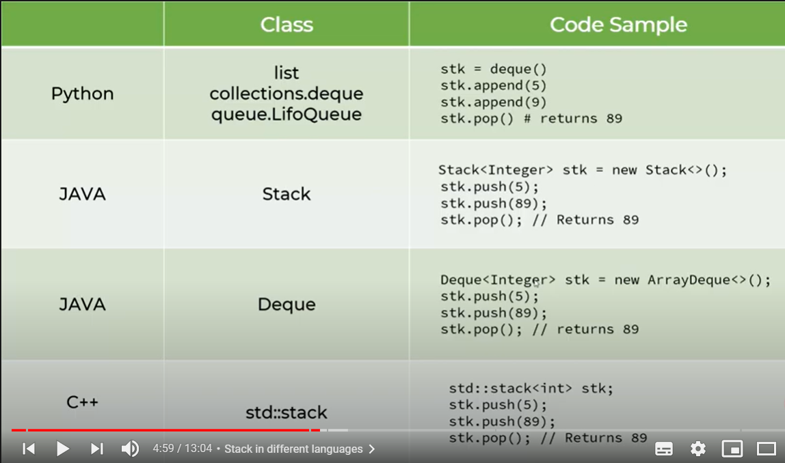
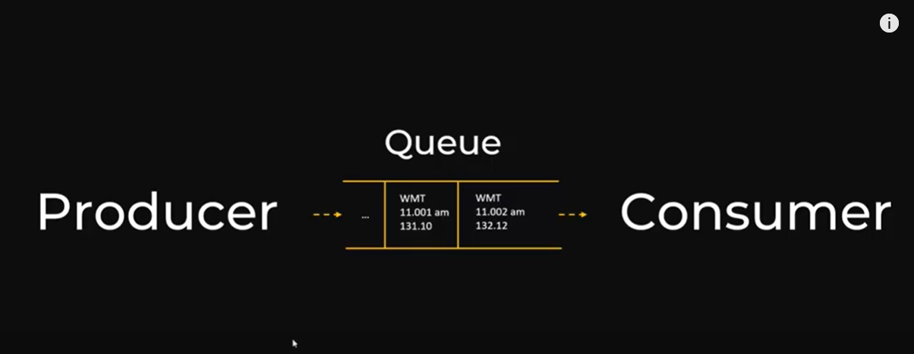
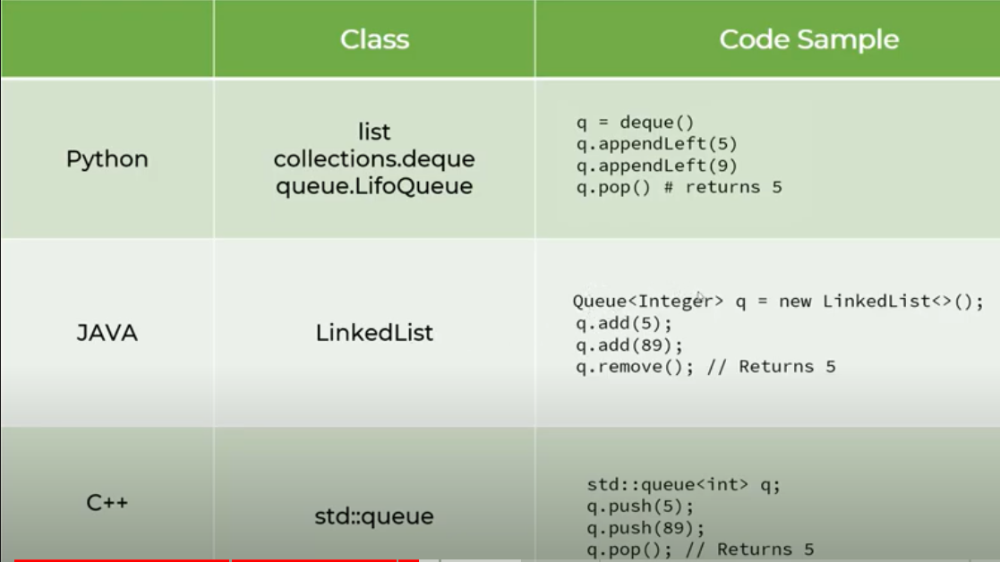

# Data-Structures-and-Algorithum

In this Repository I will upload Data structures, Algorithms and I will also explains the BIG O Complexity regarding each algorithum.

## LINKED LISTS :- 

Linked list is a data structure similar to array in a sense that it stores bunch of items. But unlike array, linked lists are not stored in contiguous memory locations. They are instead chained by an element storing address location of next element. This makes insertion very easy. Also unlike dynamic arrays you don't have to pre-allocate some memory capacity.

Advantage : 1) We don't need to pre allocate space.
            2) Insertion is easier.
            
BIG O complexities :- 

- Insert element at beginning = O(1)
- Delete element at beginning = O(1)
- Insert element at end = O(n)
- Delete element at end = O(n)
- Linked List Transversal = O(n)
- Access element by Value = O(n)

## HASH TABLE :-

Hash tables are a type of data structure in which the address or the index value of the data element is generated from a hash function. That makes accessing the data faster as the index value behaves as a key for the data value. In other words Hash table stores key-value pairs but the key is generated through a hashing function.

In Python, the Dictionary data types represent the implementation of hash tables. I have made a python file in which a Hash function is used to locate the data element value by its index value.

BIG O complexities :- 

- Insertion on average = O(1)
- Deletion on average = O(1)
- Look up by Key on average = O(1)
     

## STACKS :- 

 Stack is a very important data structure in any programming language. It takes the concept of Last in First out(LIFO). There are many real-life examples of a stack. Consider an example of plates stacked over one another in the canteen. The plate which is at the top is the first one to be removed, i.e. the plate which has been placed at the bottommost position remains in the stack for the longest period of time. So, it can be simply seen to follow LIFO(Last In First Out) order.
 
 
 
 Uses :- 
 
 - Function calling in any programming laguage is managed by stack.
 - Undo(ctrl + z) functionality is any editor used stack to track down last set of operation.

BIG O complexities :- 

- Push element = O(1)
- Pop element = O(1)
- Search element by value = O(n)

Stack in different language

## QUEUE :- 

Queue data structure is first in first out data structure also known as FIFO. It can be used at many places typically for a producer consumer type of architecture where one component is producing information and other components are consuming them. Queue allows us to implement loosely coupled architecture which has many benefits. In the python file I have taken the example of Price of a Stock at certain time interval.

BIG O complexities :- 

- Push element = O(1)
- Pop element = O(1)
- Search element by value = O(n)

Queue in different language.

